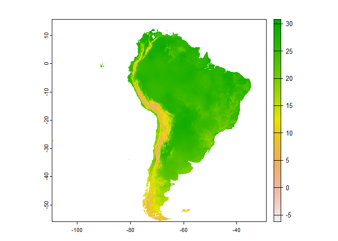
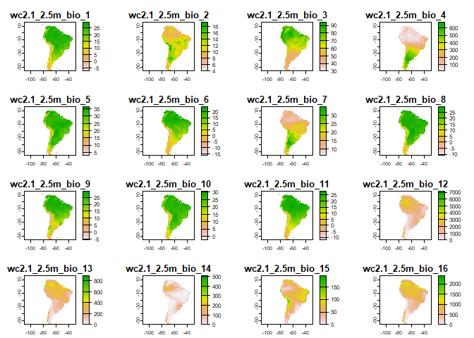

<!-- README.md is generated from README.Rmd. Please edit that file -->

# envData: download bioclimatic data from WorldClim in R

<!-- badges: start -->
<!-- badges: end -->

envData aims to facilitate the interaction with
[WorldClim](https://worldclim.org/) data. It provides a simple interface
for downloading WorldClim bioclimatic layers in R, with support for
caching and filtering retrieved data by continent.

envData is designed for easy integration of bioclimatic data into
ecological niche model pipelines. It provides a simple interface for
accessing and filtering bioclimatic data.

## Installation

You can install the development version of envData from
[GitHub](https://github.com/alrobles/envData) using the
[remotes](https://github.com/r-lib/remotes) packages:

``` r
remotes::install_github("alrobles/envData")
```

## How it workds

The original bioclimatic data stored in
[WorldClim](https://worldclim.org/) is stored in
\[TIFF\]{<https://en.wikipedia.org/wiki/TIFF>} format. envData provides
a bridge to acces this data storing on a
[DigitalOcean](https://www.digitalocean.com/) [Space Object
Storage](https://docs.digitalocean.com/products/spaces/?_gl=1*7abst9*_ga*MTQ5MzA0NzA4NS4xNzE2NjE3MDQ1*_ga_TYR2BYTLL0*MTcxNzU3MDA0MC4xMy4xLjE3MTc1NzAwNzcuMjMuMC4w)
the original data as rds binary files ready to read by the
[terra](https://rspatial.github.io/terra/) R package. Additionally we
envData provides previously cropped layers by continent enhancing the
manipulaiton in the R environment.

This functionality significantly reduces the download and clipping time
of bioclimatic layers with a
[GIS](https://en.wikipedia.org/wiki/Geographic_information_system) in an
Ecological Niche Modelling pipeline.

 \##
Usage The first time using the package the user will experiment long
wait times. This is because the package is locally caching the
information. The R packages has two main R functions. \*
`get_bio_layer`: returns an specific bioclimatic layer (i. e. bio_18)
for the entire world (default) or for a given continent. We plot the
output with the help of the [terra](https://rspatial.github.io/terra/) R
package:

``` r
library(envData)
library(terra) 
#> Warning: package 'terra' was built under R version 4.2.3
#> terra 1.7.39
```

``` r
test <- get_bio_layer("bio_10", "South America")
plot(test)
```



By the other hand `get_bioclim()` will download all the layersfor the
entire world. Also it is possible to provide a continent to get all the
bioclimatic layers:

``` r
South_America <- get_bioclim(continent = "South America")
#> [=====>------------------------------------------------] 2/19 ( 11%) eta: 3s
#> [========>---------------------------------------------] 3/19 ( 16%) eta: 3s
#> [==========>-------------------------------------------] 4/19 ( 21%) eta: 3s
#> [=============>----------------------------------------] 5/19 ( 26%) eta: 4s
#> [================>-------------------------------------] 6/19 ( 32%) eta: 4s
#> [===================>----------------------------------] 7/19 ( 37%) eta: 4s
#> [======================>-------------------------------] 8/19 ( 42%) eta: 4s
#> [=========================>----------------------------] 9/19 ( 47%) eta: 3s
#> [===========================>-------------------------] 10/19 ( 53%) eta: 3s
#> [==============================>----------------------] 11/19 ( 58%) eta: 3s
#> [================================>--------------------] 12/19 ( 63%) eta: 3s
#> [===================================>-----------------] 13/19 ( 68%) eta: 2s
#> [======================================>--------------] 14/19 ( 74%) eta: 2s
#> [=========================================>-----------] 15/19 ( 79%) eta: 1s
#> [============================================>--------] 16/19 ( 84%) eta: 1s
#> [==============================================>------] 17/19 ( 89%) eta: 1s
#> [=================================================>---] 18/19 ( 95%) eta: 0s
#> [=====================================================] 19/19 (100%) eta: 0s
```

``` r
plot(South_America)
```



It is possible to test if the server is online:

``` r
get_bio_layer("test")
#> [1] "Bioclimatic data is online"
```

``` r
get_bioclim("test")
#> [1] "Bioclimatic data is online"
```

## Citation

Please follow the [instructions from the
authors](https://worldclim.org/data/worldclim21.html) when citing
WorldClim data. At time of writing, this includes a citation to the
paper the describing the WorldClim database:

- Fick, S.E. and R.J. Hijmans, 2017. \[WorldClim 2: new 1km spatial
  resolution climate surfaces for global land
  areas\]{<https://doi.org/10.1002/joc.5086>}. *International Journal of
  Climatology* 37 (12): 4302-4315.

Use `citation("envData")` for more details and the references in BibTeX
format.
